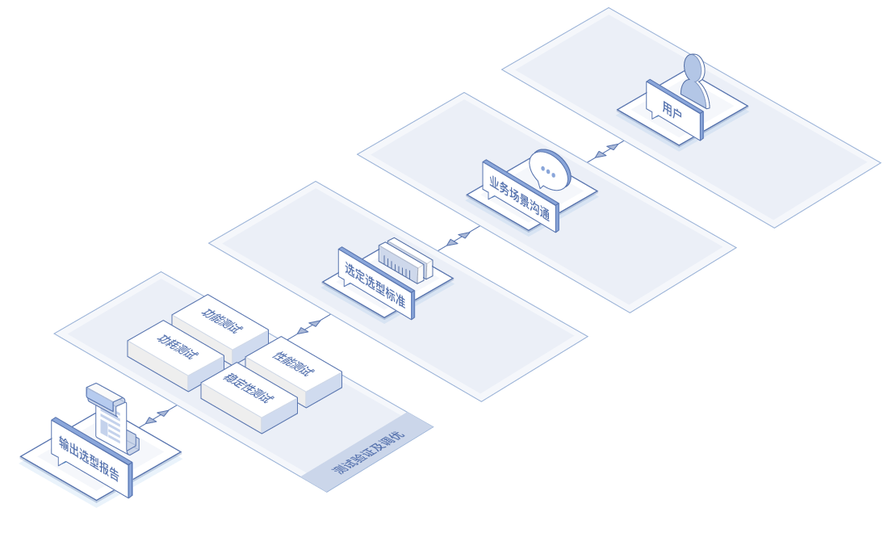

# 应用场景
## 硬件选型
根据客户的应用需求，结合京东多年来积累的硬件选型经验和对硬件技术、供应链的深入了解，提供服务器、网络设备及部件的测试选型服务。

## 电商 / O2O
面向电商交易及 O2O 场景，云数据库 RDS 解决电商中对交易数据及财务数据强一致性的苛刻要求，满足电商高并发的海量交易对性能的需求。 建议同时搭配云缓存 Redis 集群用于缓存网站数据。

## 政府公众服务平台
云数据库 RDS 丰富的功能可以满足政府公众服务平台的对数据库的各种需求；多可用区的主备架构可为政府公众服务平台提供稳定高效，安全可靠的数据服务，满足政府高可靠，高性能，高安全，低成本，易于维护的要求。

